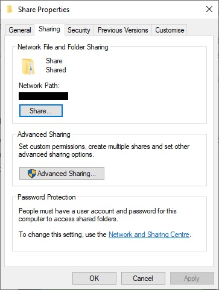
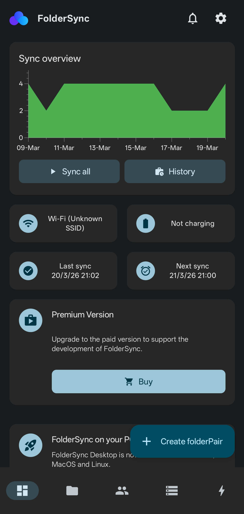

With growing concerns over internet privacy, many have turned away from using cloud services for sync and backup of their pictures on their mobile devices.

For myself, I always wanted an automated way to back up my pictures and whatever else from my phone. On the internet, most suggests using a network-attached storage (NAS). However, I always felt that it was not what I want. I wanted a simple solution without the need of another computer in the house, including the space for that and the upkeep costs.

I come to ask, what if I could have an automated way for my phone to push new files onto my PC on a daily schedule?

#### Using SMB on Windows

I have always used the SMB folder sharing feature in Windows, as a way to transfer and share files between computers and phones at home. Most devices support this protocol and it is easy to use.

#### The App that I Neded

When I realised that what I really needed is actually something really simple, I went on the hunt for the right app. It took me no time before I discovered [FolderSync](https://play.google.com/store/apps/details?id=dk.tacit.android.foldersync.lite).

This incredible app allows me to send files from my phone to my PC in an automated way. It takes just a few steps to get things set up. For me, I have a very simple configuration to push new pictures from my phone camera folder to my PC's shared folder (called "To Right Folder" in the app). Just like this, I no longer have to worry much about having a copy of the pictures from my phone.

Although I hesitate to call this a backup, knowing that a true backup still requires adherence to the 3-2-1 rule -- 3 copies, in 2 different storage mediums, and with 1 copy off-site. This is where a NAS will still truly be the best.
